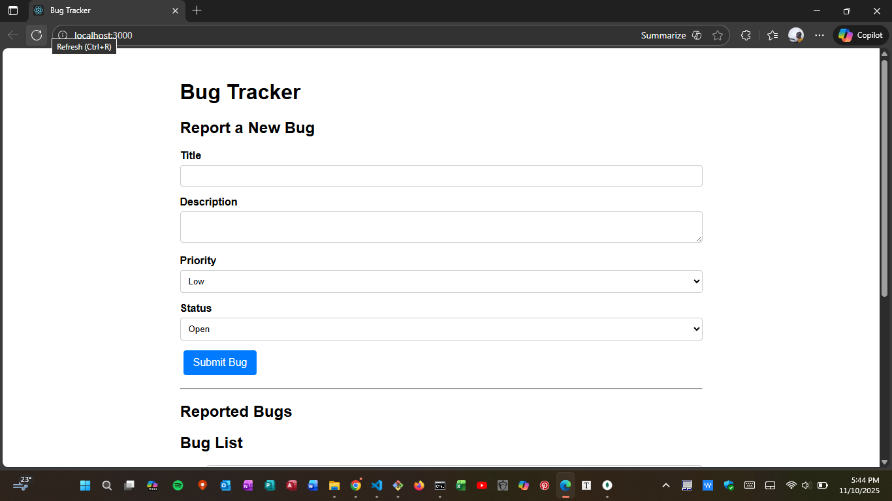
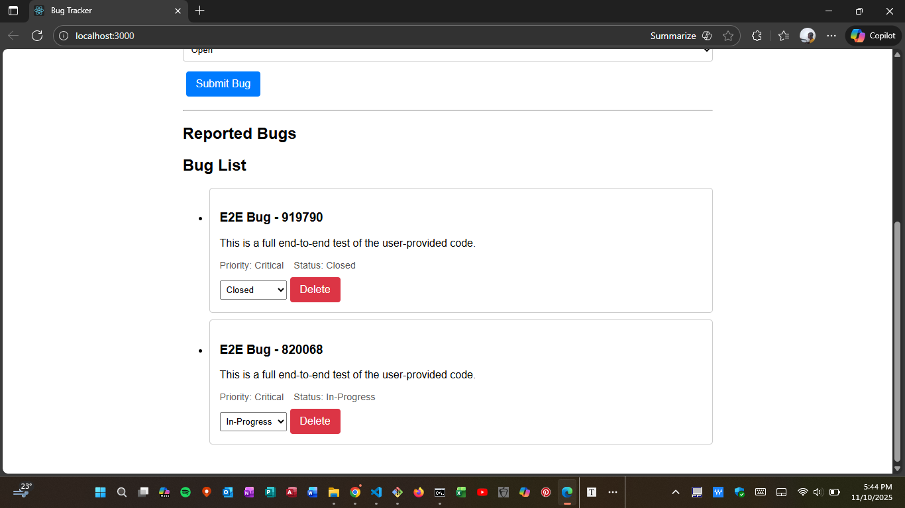
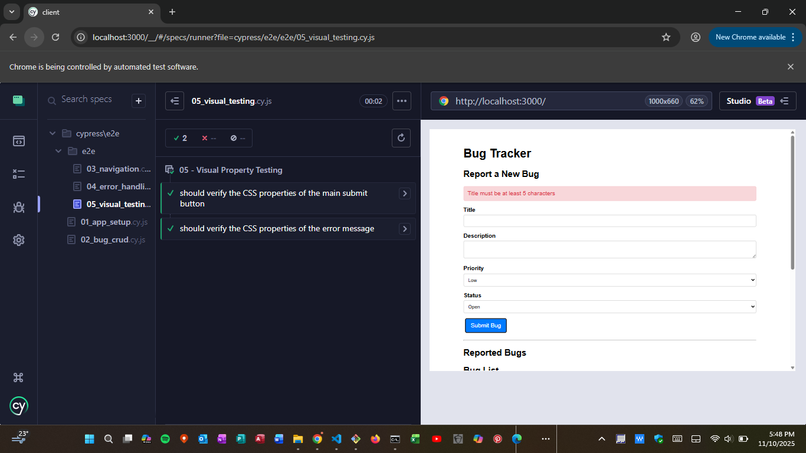

# MERN Stack Bug Tracker (Testing & Debugging Project)  

This is a full-stack MERN (MongoDB, Express, React, Node.js) application built to demonstrate a comprehensive, multi-layered testing and debugging strategy.   
The application allows users to create, read, update, and delete bug reports.  

The entire project is validated with a robust test suite that includes:  

Backend: Unit & Integration tests (Jest, Supertest)  

Frontend: Unit & Integration tests (React Testing Library)  

End-to-End (E2E): Full user-flow tests (Cypress)  

## Tech Stack  

### Core Stack  

Frontend: React (built with Create React App)  

Backend: Node.js, Express.js  

Database: MongoDB (with Mongoose)  

#### Testing & Debugging Tools  

Backend Testing: Jest, Supertest, MongoDB Memory Server  

Frontend Testing: React Testing Library, Jest  

E2E Testing: Cypress  

Debugging: React Error Boundaries, React.memo (performance), Global Express Error Handler  

### Prerequisites  

Before you begin, ensure you have the following installed on your system:  

Node.js (LTS): The v20 (LTS) release is strongly recommended.  

MongoDB: You must have a MongoDB server running locally (MongoDB Community Server) or a connection string from MongoDB Atlas.  

### Installation  

Clone the repository:  

git clone `<your-repo-url>`     
cd `<your-cloned-repo-name>`      


Install Backend Dependencies:  
(This installs Express, Mongoose, etc.)  

cd server    
`npm install`  


Install Frontend Dependencies:  
(This installs React, Axios, Cypress, etc.)  

cd ../client  
`npm install`  


Set Up the Backend Environment File:  

In the server/ folder, create a new file named .env  

Add your MongoDB connection string to this file.  
 This is the real, permanent database used when you run the app for development and Cypress testing.  
```
# This will connect to a database named 'mernBugTracker' on your local machine
MONGO_URI=mongodb://127.0.0.1:27017/mernBugTracker
```  
 ### How to Run the Application (for Cypress E2E Testing)  

This project requires three (3) separate terminals to run the full application and the E2E tests.   

Terminal 1: Start the Backend (Server)    

cd server  
`npm start`  


Your Express server will be running at http://localhost:5000 and connected to your real MongoDB.  

Terminal 2: Start the Frontend (Client)  

cd client  
`npm start`  


Your React application will open in your browser at http://localhost:3000.  

Terminal 3: Run Cypress (E2E Tests)  

Navigate to the client directory:  

cd client  


Run the Cypress command:  

`npx cypress open`  


The Cypress Test Runner will open. Click "E2E Testing".  

Click on any test file (e.g., 02_bug_crud.cy.js) to watch the test run live against your real, running application.  

### 🧪Running Other Tests  

This project includes multiple levels of testing that do not require the full application to be running.  

#### 1. Backend Testing (Jest & Supertest)  

These tests validate the API routes and database logic in memory. They do not use your real database.   
They automatically start and stop a temporary mongodb-memory-server for each test run.  

To run all backend tests:  

cd server  
`npm test`  


To run only integration tests (API + DB):  

cd server  
`npm run test:integration`  


To run only unit tests (e.g., controllers):  

cd server  
`npm run test:unit`  


#### 2. Frontend Testing (React Testing Library)  

These tests validate React components in isolation without loading the full backend.  

cd client  
`npm test`  


###  Testing & Debugging Approach  

This project uses a "Testing Pyramid" strategy and a "Two-Database System" to ensure reliability.  

#### The Two-Database System  

Development/E2E Mode (npm start):  
When running the main app, the server connects to the real MongoDB database specified in the .env file.    
Cypress tests run against this real, running application.      

Integration Test Mode (npm run test:integration):   
When running Jest/Supertest, the test files ignore the .env file and instead launch a temporary, in-memory database (mongodb-memory-server).   
This ensures tests are fast, isolated, and do not fill your real database with test data.  

#### Debugging & Resilience  

Backend:   
A Global Error Handler (server/src/app.js) catches all server-side crashes, logs them with console.error(err.stack), and sends a safe JSON error to the client.  

Frontend:  
 A React Error Boundary (client/src/components/ErrorBoundary.jsx) wraps the entire application, catching any JavaScript errors and displaying a fallback UI instead of a blank white screen.  

#### Performance:  

Frontend:  
 React.memo is used on components like Button.jsx to prevent unnecessary re-renders (monitored with the React Profiler and console.log).  

Backend:  
 The getBugs API route is monitored with console.time(), and the Bug model is optimized with a database index on createdAt for fast sorting.  
 
 ## 🖼️ App Screenshots  

### Screenshot 1  
  

### Screenshot 2  
  

### Screenshot 3  
  


